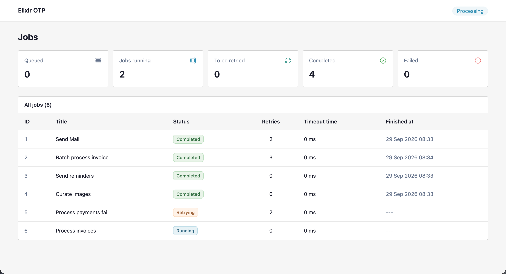

# Elixir OTP

A background job-processing demo built with Elixir, OTP, and Phoenix LiveView. Its purpose is to show how GenServers, supervised tasks, an in-memory queue, and ETS work together to process jobs and display their progress in real time.



## What it demonstrates

- A FIFO job queue managed by a GenServer.
- Up to five concurrent workers started through a Task.Supervisor.
- Failure and crash handling with up to three retries per job.
- Deferred retries with exponential backoff when queued jobs or busy workers take priority.
- Job state stored in ETS and broadcast through Phoenix.PubSub to a live dashboard.

This is a learning project, not a production job queue. Jobs simulate work rather than sending real emails or processing payments. The queue and job history are held in memory and are lost when the application stops; no database is required.

## Run locally

Install [Elixir](https://elixir-lang.org/install.html) 1.17 or later (within the 1.x series), a compatible Erlang/OTP release, and Git. Mix is included with Elixir.

From the project directory, install dependencies and build the assets:

```sh
mix setup
```

Start the server:

```sh
mix phx.server
```

Open [http://localhost:4000](http://localhost:4000) to view the jobs dashboard. Keep the server running and submit jobs from another terminal using the example below. The dashboard updates automatically.

To run the server with an interactive Elixir shell instead:

```sh
iex -S mix phx.server
```

## Submit jobs

Send a JSON request to `POST /api/job/queue`:

```sh
curl -X POST http://localhost:4000/api/job/queue \
  -H 'Content-Type: application/json' \
  -d '{"job_title":"Send Mail"}'
```

The endpoint returns HTTP `201` with the created job under the `job` key. Repeat the request with different titles to populate the dashboard.

When running the server inside IEx, you can also enqueue jobs directly:

```elixir
ElixirOtp.JobQueue.add_job("Send Mail")
ElixirOtp.JobQueue.add_job("Process payments fail")
ElixirOtp.JobQueue.add_job("Worker crash")
```

Each attempt simulates 15 seconds of work. Ordinary jobs randomly succeed or fail. A title containing lowercase `fail` always fails; a title containing lowercase `crash` makes the worker raise an exception. These cases let you watch retries and eventual failures in the dashboard.

The dashboard's timeout value represents a deferred retry delay, not an execution time limit.

## Development checks

Run the project's checks before submitting changes:

```sh
mix precommit
```

This compiles with warnings treated as errors, removes unused dependency locks, formats the code, and runs the tests.

## Learn more

- [Elixir documentation](https://hexdocs.pm/elixir/)
- [Phoenix guides](https://phoenix.hexdocs.pm/overview.html)
- [Phoenix LiveView documentation](https://hexdocs.pm/phoenix_live_view/)
